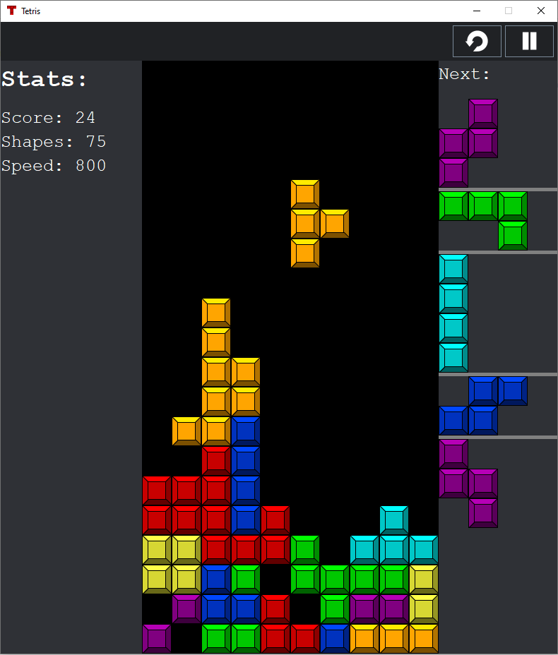

# Tetris
A Java implementation of the game Tetris!

## Example Screenshot

  

## Key Bindings
Key |  Function
---- | --------------------------------------------------------------------------------------
A  | Move current shape to the left
S  | Move current shape down
D  | Move current shape right
<- | Turn shape 90° counter-clockwise
-> | Turn shape 90° clockwise